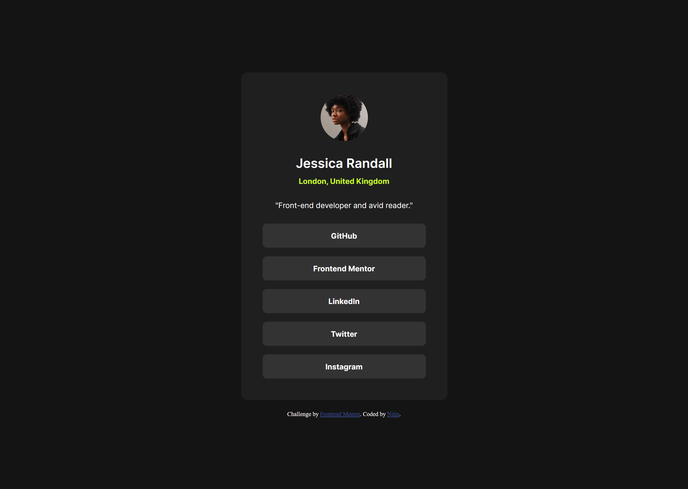

# Frontend Mentor - Social links profile solution

This is a solution to the [Social links profile challenge on Frontend Mentor](https://www.frontendmentor.io/challenges/social-links-profile-UG32l9m6dQ). Frontend Mentor challenges help you improve your coding skills by building realistic projects.

## Table of contents

- [Overview](#overview)
  - [The challenge](#the-challenge)
  - [Screenshot](#screenshot)
  - [Links](#links)
- [My process](#my-process)
  - [Built with](#built-with)
  - [What I learned](#what-i-learned)

## Overview

### The challenge

Users should be able to:

- See hover and focus states for all interactive elements on the page

### Screenshot



### Links

- Solution URL: [github](https://github.com/nitinrs95/social-links-profile-main.git)
- Live Site URL: [Add live site URL here](https://nitinrs95.github.io/social-links-profile-main/)

## My process

### Built with

- Semantic HTML5 markup
- CSS custom properties
- Flexbox
- Desktop-first workflow

### What I learned

1. **Difference Between min-width and max-width**
   Gained a clearer understanding of the distinction between **min-width** and **max-width**, particularly in the context of responsive design. While there is still much to explore, this serves as a solid foundation.

2. **Using the transition Property for Smooth Size Changes**  
   Implemented smooth transitions for container size adjustments when the screen size changes by leveraging the **transition** property. This resulted in a more polished and seamless user experience.

```css
.profile {
  min-width: 38.4rem;
  background-color: var(--grey-800);
  display: flex;
  flex-direction: column;
  gap: 2.4rem;
  justify-content: center;
  align-items: center;
  padding: 4rem 4rem;
  border-radius: 12px;
  transition: min-width 0.3s ease-in-out;
}
```
